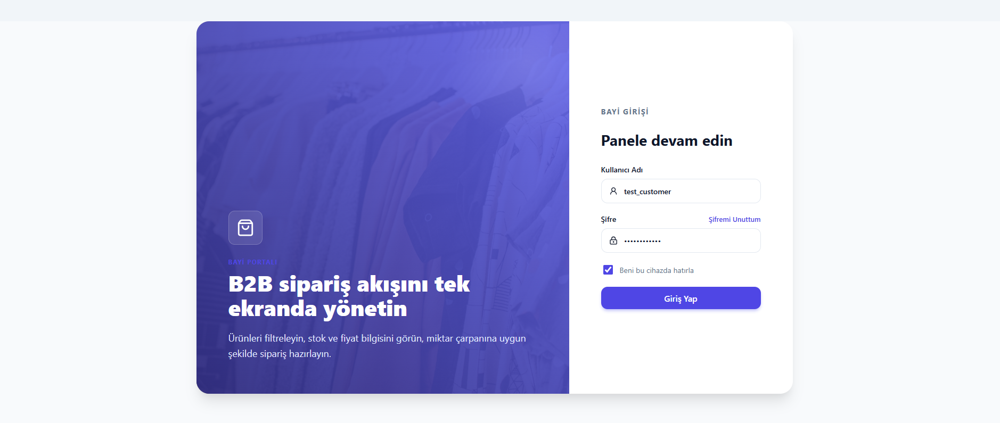
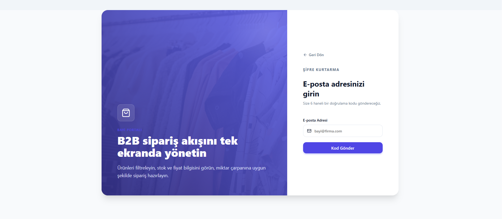
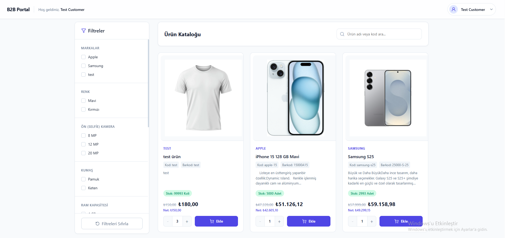
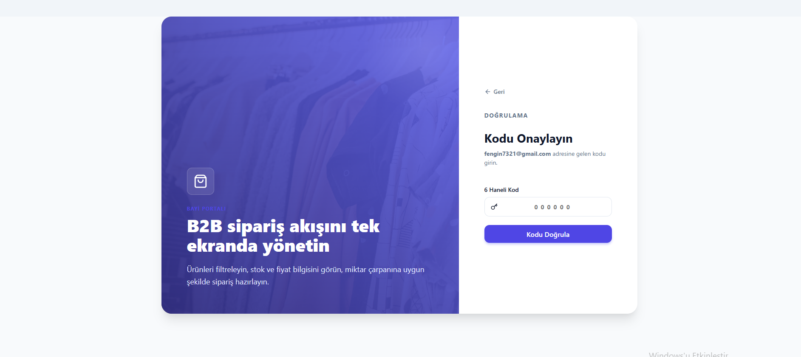

# B2B Portal Projesi

Bu proje, bayilerin ürün filtreleme, stok/fiyat kontrolü yapabileceği ve sipariş akışını yönetebileceği modern bir B2B (İşletmeden İşletmeye) portal arayüzüdür.

---

## 📸 Ekran Görüntüleri

### Giriş (Login) Ekranı
Kullanıcıların sisteme güvenli bir şekilde giriş yaptığı, modern cam efektine (glassmorphism) sahip giriş paneli.

<p align="center">
  
</p>

### Şifremi Unuttum (Forgot Password)
Sayfadan ayrılmadan, akıcı bir UX (Kullanıcı Deneyimi) ile şifre sıfırlama adımları.

<p align="center">
  
</p>

### Kullanıcı / Dashboard (Me)
Bayi bilgilerinin ve ana portal ekranının görünümü.

<p align="center">
  
</p>

### Doğrulama Kodu (Code)


<p align="center">
  
</p>

---

## 🚀 Kurulum

Projeyi yerel ortamınızda çalıştırmak için:

1. Depoyu klonlayın ve bağımlılıkları yükleyin:
   ```bash
   npm install
